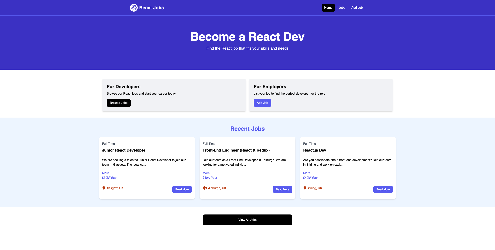
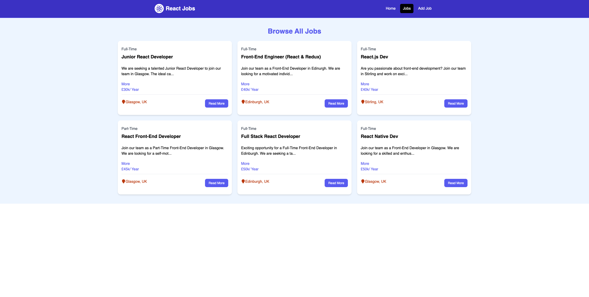
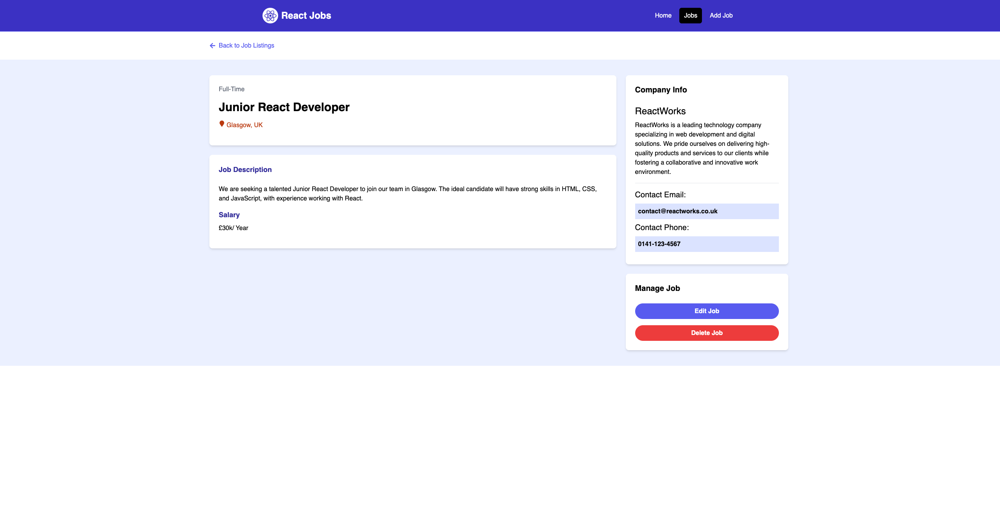
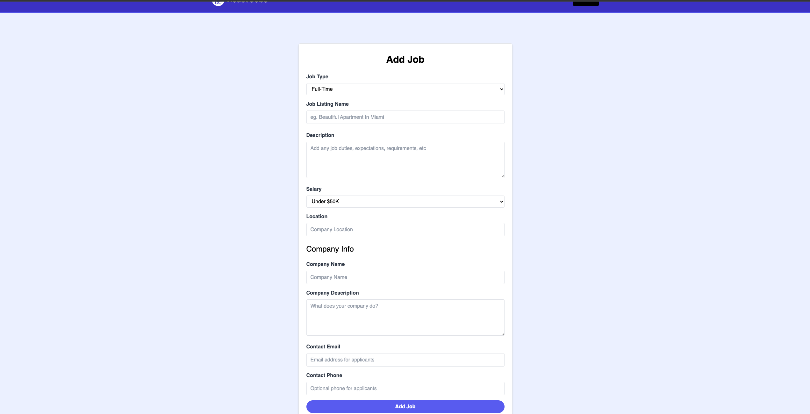

# React Jobs

This is the final product from a code along tutorial. The tutorial can be found here:

https://www.youtube.com/watch?v=LDB4uaJ87e0&t=2559s


## Installation

Install React Jobs:

```bash
    1. Download and unzip the repo
    2. Terminal 1: npm i
    3. Terminal 1: npm run dev
    4. Terminal 2: npm run server
    5. Head to http://localhost:3000 in your browser.
```
    
## Screenshots










## Acknowledgements

 - [Awesome Readme Templates](https://awesomeopensource.com/project/elangosundar/awesome-README-templates)
 - [Awesome README](https://github.com/matiassingers/awesome-readme)
 - [How to write a Good readme](https://bulldogjob.com/news/449-how-to-write-a-good-readme-for-your-github-project)
